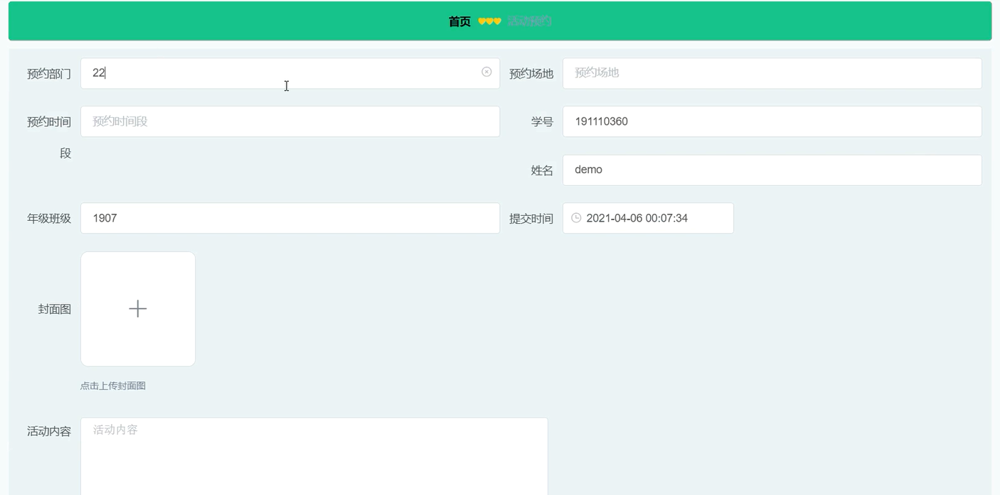

**项目简介：**  
本项目基于主流的前后端分离架构，采用 **SpringBoot + Vue 技术栈**，配套 **MySQL 数据库**，适用于毕业设计与课题实训开发。  
本人已整理了超 **4000 多套毕业设计源码+论文+开题报告+PPT...**，涵盖 **Java、SpringBoot、Vue、SSM、uni-app 小程序、PHP、Android** 等方向，支持功能修改定制与论文服务。  
**团队提供以下服务：**  
- 项目代码修改与调试  
- 数据库配置与远程协助  
- 论文定制与修改  
**获取更多的4000多套源码或SQL文件请联系：**  
- QQ：3906443360 微信：BesheHelp

## springboot036海滨体育馆管理系统的设计与实现

**项目简介：**  
本项目基于主流的前后端分离架构，采用 **SpringBoot + Vue 技术栈**，配套 **MySQL 数据库**，适用于毕业设计与课题实训开发。  
本人已整理了超 **4000 多套毕业设计源码+论文+开题报告+PPT...**，涵盖 **Java、SpringBoot、Vue、SSM、uni-app 小程序、PHP、Android** 等方向，支持功能修改定制与论文服务。  
**团队提供以下服务：**  
- 项目代码修改与调试  
- 数据库配置与远程协助  
- 论文定制与修改  
**获取更多的4000多套源码或SQL文件请联系：**  
- QQ：3906443360 微信：BesheHelp**

# 系统实现与系统测试

# 系统的实现

登录模块的实现

管理员和学生在登录界面输入用户名、密码，选择类型进行登录操作，系统登录界面展示如图5-1所示。

图5-1系统登录界面图

注册模块的实现

没有账号的学生用户可进行注册操作，学生注册界面如图5-2所示。

图5-2  学生注册界面

学生管理模块的实现

管理员可添加、修改和删除学生信息，学生管理界面如图5-3所示。

图5-3 学生管理界面

系统主界面模块的实现

学生可进入系统前台查看系统信息，包括首页、器材以及体育论坛等，系统主界面如图5-4所示。

图5-4 系统主界面

器材管理模块的实现

管理员可以添加、修改和删除器材信息，学生可查看器材信息，器材管理界面展示如图5-4所示。

图5-5 器材管理界面

器材借出管理模块的实现

学生可添加器材借出信息，管理员可查看管理所有器材借出信息，并可对其进行修改和删除操作，同时也可添加器材借出信息，器材借出管理界面如图5-6所示，添加器材借出界面展示如图5-7所示。

图5-6 器材借出管理界面

图5-7 添加器材借出界面

活动预约管理模块的实现

学生可添加活动预约信息，管理员可查看活动预约信息，并可对其进行审核、修改和删除操作，活动预约管理界面如图5-8所示，添加活动预约界面展示如图5-9所示。

图5-8 活动预约管理界面

图5-9 添加活动预约界面

